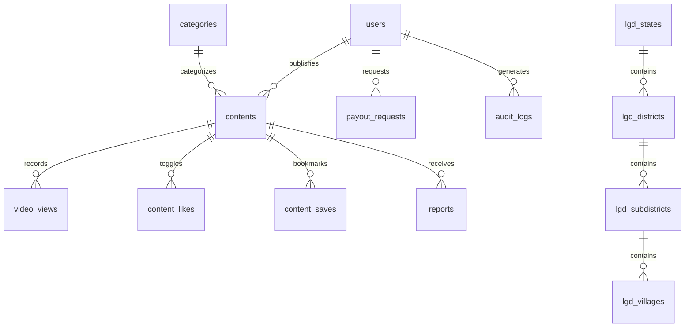

# Nagrik Data Architecture & PostgreSQL Schema Specification

## 1. Executive Summary

Nagrik's data layer is hosted on Supabase PostgreSQL 17.6 (`ap-south-1`, Mumbai region) with PostGIS 3.5 spatial capabilities and `pg_trgm` fuzzy matching. The data layer is engineered for:
- 50,000+ Daily Active Users (DAU) and 1,000,000+ total devices.
- Keyset cursor-based pagination for linear-time feed querying (`O(1)` offset overhead).
- Complete Row-Level Security (RLS) enforcement at the engine level.
- PII sanitization via security barrier views (`public_author_profiles`).
- Server-authoritative anti-abuse RPCs with immutable audit trails.

---

## 2. Core Entity Relationship Model



---

## 3. Schema & Table Definitions

### 3.1 `users` (Identity & Publisher Ledger)
Primary user entity for authenticated publishers and administrators. Consumers operate in a zero-login model.
- `id` (UUID, PK): References `auth.users(id)` ON DELETE CASCADE.
- `role` (`user_role` enum): `'CONSUMER'`, `'PUBLISHER'`, `'ADMIN'`.
- `phone` (TEXT, UNIQUE): E.164 phone number. Restricted to self/admin.
- `email` (TEXT, UNIQUE): Email address. Restricted to self/admin.
- `full_name` (TEXT NOT NULL): Display name.
- `channel_name` (TEXT): Publisher channel identifier.
- `wallet_balance` (NUMERIC(12,2) DEFAULT 0.00): Accrued monetization balance.
- `lifetime_earnings` (NUMERIC(12,2) DEFAULT 0.00): Total historical earnings.
- `status` (TEXT DEFAULT 'ACTIVE'): `'ACTIVE'`, `'SUSPENDED'`, `'PENDING_VERIFICATION'`.
- **Security Barrier**: `public_author_profiles` view exposes only `id`, `full_name`, `channel_name`, `avatar_url`, `is_verified` to anonymous and consumer clients.

### 3.2 `contents` (Hyperlocal Articles, Shorts & Live Feeds)
Central content catalog supporting both editorial articles and vertical shorts.
- `id` (UUID, PK): `gen_random_uuid()`.
- `author_id` (UUID, FK -> `users.id`): Content creator.
- `category_id` (UUID, FK -> `categories.id`): Editorial category.
- `content_type` (`content_type` enum): `'ARTICLE'`, `'VIDEO'`, `'POLL'`, `'ALERT'`.
- `title` (TEXT NOT NULL): Article or video headline.
- `description` (TEXT): Body copy or video summary.
- `video_url` (TEXT): Cloudflare R2 CDN URL (`/videos/...`).
- `thumbnail_url` (TEXT): Cloudflare R2 CDN URL (`/thumbnails/...`).
- `aspect_ratio` (NUMERIC(4,2)): Video aspect ratio (e.g., 0.56 for 9:16 vertical shorts).
- `duration_seconds` (INT): Video playback duration.
- `state_code`, `district_code`, `subdistrict_code`, `village_code` (INT): LGD census location hierarchy.
- `location_geom` (GEOGRAPHY(Point, 4326)): PostGIS coordinates for proximity ranking.
- `view_count`, `like_count`, `save_count`, `share_count`, `comment_count` (BIGINT DEFAULT 0).
- `status` (`content_status` enum): `'DRAFT'`, `'PENDING_REVIEW'`, `'PUBLISHED'`, `'REJECTED'`, `'ARCHIVED'`.
- `published_at` (TIMESTAMPTZ DEFAULT now()).

### 3.3 `video_views` (Server-Authoritative Monetization Events)
Immutable log of legitimate views eligible for publisher monetization.
- `id` (BIGSERIAL, PK).
- `content_id` (UUID, FK -> `contents.id` ON DELETE CASCADE).
- `viewer_id` (UUID, NULLABLE, FK -> `users.id`): Authenticated user ID if logged in.
- `device_id` (TEXT NOT NULL): Persistent device UUID for mobile consumer views.
- `ip_hash` (TEXT NOT NULL): SHA-256 salted hash of client IP.
- `watch_time_seconds` (NUMERIC(6,2) NOT NULL): Validated client playback duration.
- `completion_rate` (NUMERIC(5,4) NOT NULL): `watch_time / duration`.
- `is_monetized` (BOOLEAN DEFAULT FALSE): True if view meets monetization threshold.
- `created_at` (TIMESTAMPTZ DEFAULT now()).
- **Anti-Abuse Constraint**: Max 3 monetized views per `(device_id, content_id)` per 24 hours.

### 3.4 `content_likes` & `content_saves` (Atomic Engagement)
- `content_id` (UUID, FK -> `contents.id`).
- `user_id` (UUID, NULLABLE).
- `device_id` (TEXT NOT NULL).
- `created_at` (TIMESTAMPTZ DEFAULT now()).
- Unique constraints: `(content_id, user_id)` and `(content_id, device_id)` ensure strict idempotency.

---

## 4. Indexing Strategy & Execution Paths

| Table | Index Name | Type | Key Columns / Expression | Query Target |
| :--- | :--- | :--- | :--- | :--- |
| `contents` | `idx_contents_published_feed` | B-tree | `(status, published_at DESC, id)` | Global chronological feed |
| `contents` | `idx_contents_district_feed` | B-tree | `(district_code, status, published_at DESC)` | District localized feed |
| `contents` | `idx_contents_subdistrict_feed` | B-tree | `(subdistrict_code, status, published_at DESC)`| Sub-district localized feed |
| `contents` | `idx_contents_video_feed` | B-tree | `(content_type, status, published_at DESC)` | Vertical video shorts feed |
| `contents` | `idx_contents_author_status` | B-tree | `(author_id, status)` | Publisher dashboard |
| `contents` | `idx_contents_title_trgm` | GIN | `title gin_trgm_ops` | Fuzzy headline search |
| `contents` | `idx_contents_desc_trgm` | GIN | `description gin_trgm_ops` | Fuzzy body search |
| `contents` | `idx_contents_geom` | GiST | `location_geom` | PostGIS proximity ranking |
| `video_views`| `idx_views_dedup_daily` | B-tree | `(content_id, device_id, created_at)` | Monetization rate capping |
| `video_views`| `idx_views_content_created` | B-tree | `(content_id, created_at DESC)` | Publisher video analytics |
| `payout_requests` | `idx_payouts_user_status` | B-tree | `(user_id, status)` | Payout history lookup |
| `payout_requests` | `idx_payouts_pending` | B-tree | `(status, created_at)` WHERE status = 'PENDING' | Admin payout queue |
| `audit_logs` | `idx_audit_logs_target` | B-tree | `(target_type, target_id, created_at DESC)` | Compliance audits |

---

## 5. Keyset (Cursor) Pagination Implementation

To prevent performance degradation at high page depths (`OFFSET 50000` requires reading 50,000 tuples), Nagrik strictly utilizes keyset pagination:

```sql
SELECT c.*
FROM contents c
WHERE c.status = 'PUBLISHED'
  AND (
    v_cursor_timestamp IS NULL 
    OR (c.published_at, c.id) < (v_cursor_timestamp, v_cursor_id)
  )
ORDER BY c.published_at DESC, c.id DESC
LIMIT p_limit + 1;
```

- When the returned row count is `p_limit + 1`, `hasMore` is set to `true`, and the `p_limit + 1`-th row is discarded from the result set.
- Next cursor payload: `{ "cursor_timestamp": last_item.published_at, "cursor_id": last_item.id }`.
- Execution Plan: Index scan on `idx_contents_published_feed` in `O(limit)` constant time.

---

## 6. Retention, Archival & Partitioning Model

- **`video_views` Table**: Projected to receive 500,000+ rows/day at 50,000 DAU.
  - Automated weekly cron aggregates daily view counts into `publisher_daily_metrics`.
  - Raw event retention: 90 days. Rows older than 90 days are pruned using pg_cron.
  - At 1,000,000 DAU, declarative range partitioning by month (`created_at`) is scheduled.
- **`audit_logs` Table**: Retained for 7 years for compliance and financial audits. Indexed on `(target_type, target_id)`.
