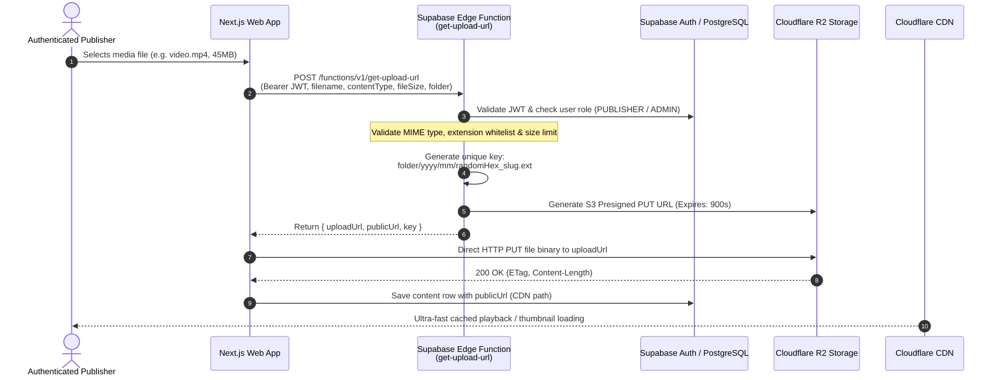

# Nagrik Media Pipeline & Cloudflare R2 Architecture

## 1. Overview & Architectural Principles

Nagrik exclusively uses **Cloudflare R2** for persistent media storage, fronted by a dedicated **Cloudflare CDN** custom domain.
- **Zero Supabase Storage Dependency**: Supabase Storage is not utilized; all binary assets (videos, images, thumbnails, avatars) reside in Cloudflare R2 bucket `nagrik-media`.
- **Zero Client Credential Leakage**: No R2 access keys, secret keys, or Supabase service-role keys are ever packaged in mobile builds or web client bundles.
- **No `r2.dev` in Production**: The `r2.dev` domain is strictly reserved for internal staging; production media traffic traverses Cloudflare edge CDN with tiered caching.

---

## 2. Secure Upload Architecture



---

## 3. Storage Hierarchy & Folder Organization

```text
nagrik-media/
├── articles/
│   └── 2026/
│       └── 09/
│           └── b7f28a1c90_delhi_metro_expansion.webp
├── videos/
│   └── 2026/
│       └── 09/
│           └── e4d930f11a_traffic_update_short.mp4
├── thumbnails/
│   └── 2026/
│       └── 09/
│           └── e4d930f11a_traffic_update_thumb.webp
├── profiles/
│   └── avatars/
│       └── usr_78ab41_channel_logo.webp
└── ads/
    └── creatives/
        └── campaign_109_banner.webp
```

---

## 4. Edge Validation & Security Constraints

The `get-upload-url` Edge Function enforces strict server-side validation:
1. **Folder Whitelist**: `'videos'`, `'articles'`, `'thumbnails'`, `'profiles'`, `'ads'`.
2. **File Size Limits**:
   - Videos: Maximum **100 MB** (`104,857,600` bytes).
   - Images & Thumbnails: Maximum **10 MB** (`10,485,760` bytes).
   - Profile Avatars: Maximum **5 MB** (`5,242,880` bytes).
3. **MIME Type & Extension Matching**:
   - `video/mp4` $\leftrightarrow$ `.mp4`
   - `video/webm` $\leftrightarrow$ `.webm`
   - `video/quicktime` $\leftrightarrow$ `.mov`
   - `image/jpeg` $\leftrightarrow$ `.jpg`, `.jpeg`
   - `image/png` $\leftrightarrow$ `.png`
   - `image/webp` $\leftrightarrow$ `.webp`
4. **Presigned URL TTL**: Strictly 15 minutes (`900` seconds).
5. **Key Non-Collision**: Each key is prefixed with a 16-character cryptographic hex string (`crypto.getRandomValues`).

---

## 5. Cloudflare CDN Caching & Edge Optimization

### 5.1 Production Domain Mapping
- Storage bucket: `nagrik-media` (Account ID: `2377a16d493ea0b8e3ae344fcb089d4f`)
- Public CDN domain: `https://media.nagrik.app` (or fallback `https://pub-2377a16d493ea0b8e3ae344fcb089d4f.r2.dev` in staging)

### 5.2 Cache-Control Headers
- **Versioned Media (`/videos/*`, `/articles/*`, `/thumbnails/*`)**:
  ```http
  Cache-Control: public, max-age=31536000, immutable
  ```
  Since keys use cryptographic hashes, files are immutable. This enables Cloudflare edge nodes to cache content indefinitely without re-fetching from R2, driving R2 Class B egress costs to near-zero.
- **Dynamic Assets (`/profiles/*`)**:
  ```http
  Cache-Control: public, max-age=86400, stale-while-revalidate=604800
  ```

### 5.3 Video Streaming & Range Requests
Cloudflare R2 natively supports HTTP `Range: bytes=0-1048575` headers. This allows the Flutter video player and web HTML5 players to start video playback immediately within $< 300\text{ ms}$ of request by fetching the initial metadata atom and first few frames without buffering the complete file.
